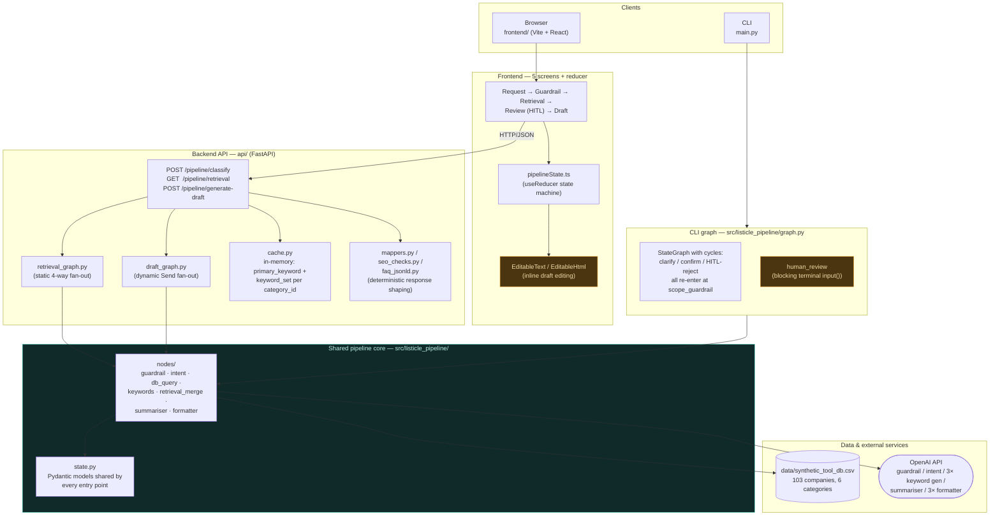
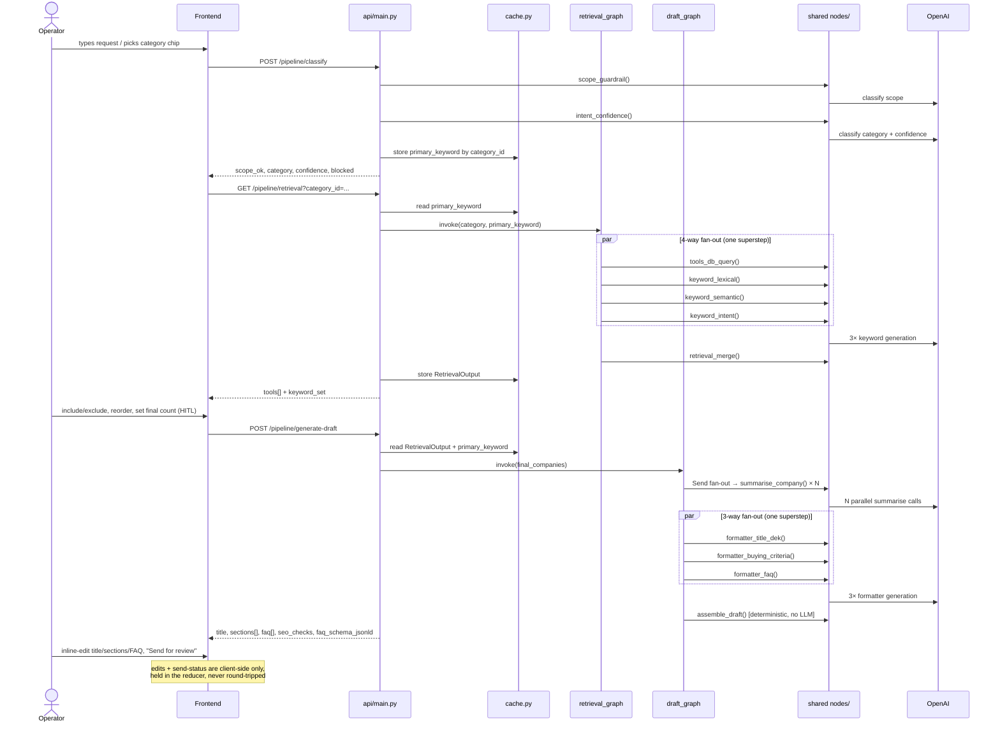

# Architecture Diagram

Companion diagram to [`docs/README.md`](./README.md). Two views: the static component
layout, and the dynamic request flow for one full listicle generation.

---

## 1. Component overview

**Reading the colors:** amber-outlined boxes (`human_review`, inline editing) are the
human-decision points — everything else is deterministic or LLM-automated. This mirrors
the teal/amber convention already used in the frontend's pipeline rail
(`frontend/src/components/PipelineRail.tsx`).

**The one fact this diagram exists to make obvious:** `api/retrieval_graph.py` and
`api/draft_graph.py` do not reimplement any pipeline logic. They import the exact same
node functions from `src/listicle_pipeline/nodes/` that the CLI's `graph.py` uses, and
wire them into small, purpose-built `StateGraph`s that fit the API's stateless
request/response shape (no cycles, no blocking terminal I/O). The CLI and the API are
two different *orchestrations* of one shared core, not two implementations.

---

## 2. Request flow — one full listicle, browser path

**The CLI path** runs the same `scope_guardrail` → `intent_confidence` →
[`tools_db_query` ∥ 3× `keyword_*`] → `retrieval_merge` sequence, but then hits
`human_review` — a real blocking `input()` call in the terminal — instead of returning
to a client. Rejecting at that step re-enters at `scope_guardrail` (same node, capped
retries), which is the "every failure routes back to one re-entry point" principle from
the original design README. Once approved, it continues through the identical
`summarise_company` → formatter fan-out → `assemble_draft` sequence and writes
`output/<slug>.json`.
